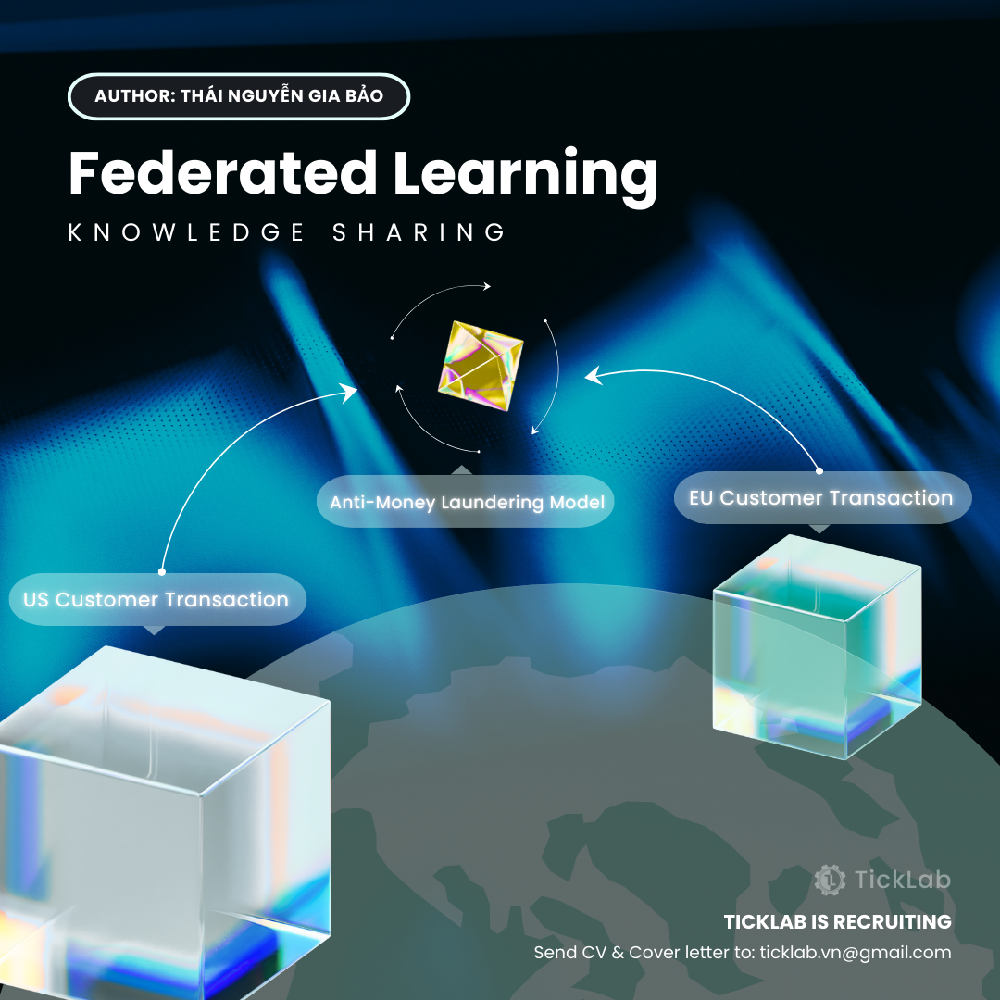
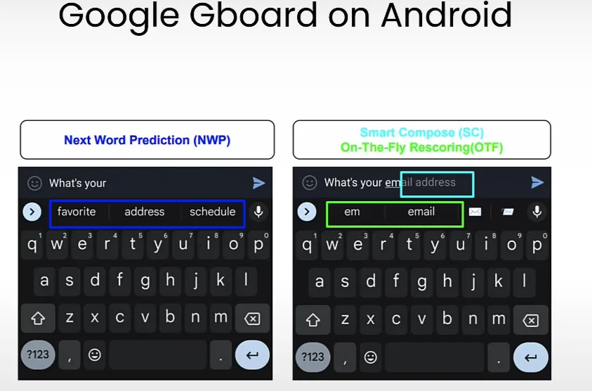
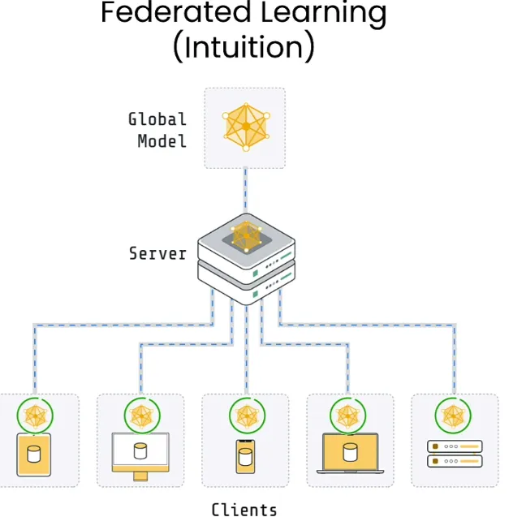
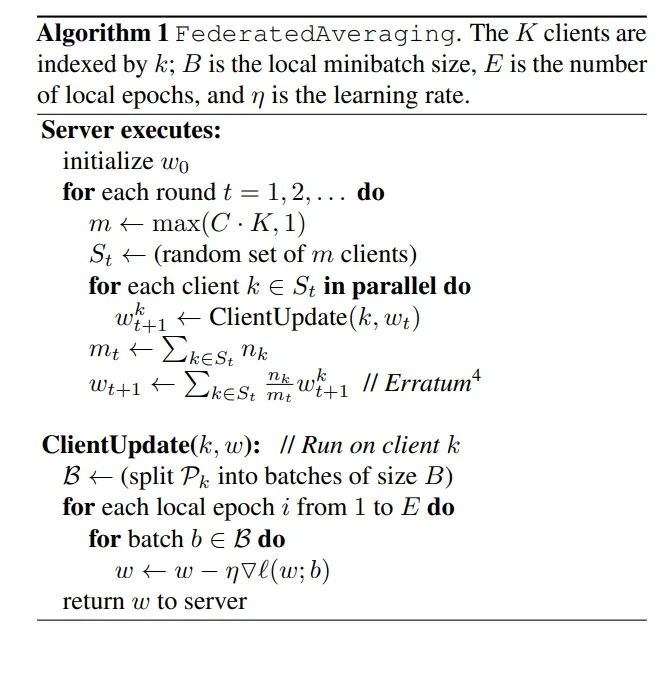
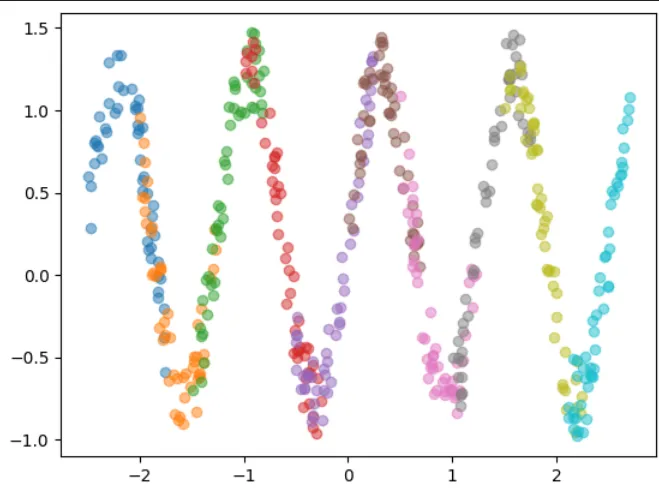
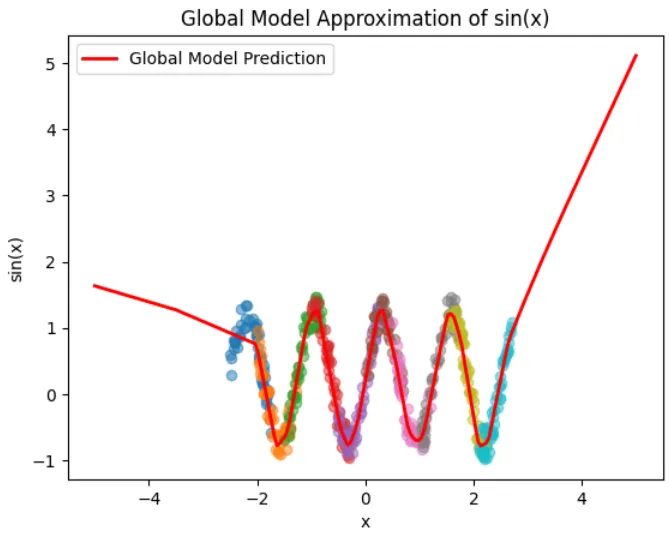
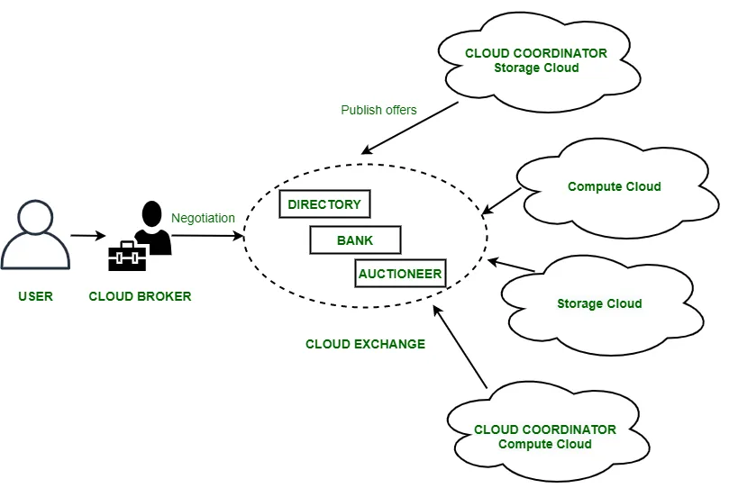
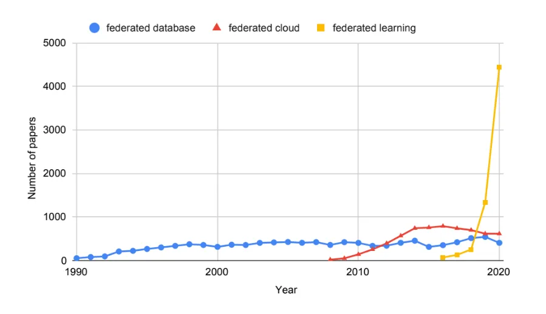

# Federated Learning – Cách mạng AI bảo vệ quyền riêng tư (Part 1)

<figure markdown>

{ width="1100" }

</figure>

Federated Learning (FL) được đề xuất năm 2016 bởi một nhóm nghiên cứu tại Google, mang đến giải pháp đột phá trong việc xây dựng các mô hình trí tuệ nhân tạo từ nguồn dữ liệu phân tán mà không làm tổn hại đến quyền riêng tư người dùng. Khác với cách làm truyền thống, dữ liệu cá nhân không còn bị thu thập tập trung vào máy chủ; thay vào đó, mỗi thiết bị tự thực hiện quá trình huấn luyện mô hình trực tiếp trên dữ liệu riêng của mình. Chỉ có các thông số (weight, bias) đã được huấn luyện mới được gửi về máy chủ trung tâm để tổng hợp thành một mô hình chung. Điều này không chỉ bảo vệ tuyệt đối thông tin cá nhân mà còn tận dụng hiệu quả sức mạnh tính toán từ hàng triệu thiết bị.

Hãy cùng tác giả tìm hiểu sâu hơn về công nghệ tiên tiến này trong bài chia sẻ chi tiết dưới đây!

<!-- more -->

## I. Giới thiệu chung

Federated Learning ra đời vào khoảng năm 2016, xuất phát từ nhu cầu cấp thiết trong việc xây dựng các mô hình trí tuệ nhân tạo và máy học trên dữ liệu phân tán nhưng đồng thời phải bảo đảm quyền riêng tư của người dùng.

Trước Federated Learning, các hệ thống máy học chủ yếu dựa trên cách thu thập dữ liệu từ hàng triệu thiết bị (điện thoại di động, thiết bị IoT...) về các trung tâm dữ liệu tập trung (centralized data centers) để huấn luyện mô hình AI. Tuy nhiên, cách làm này tồn tại hai vấn đề lớn:

- Người dùng ngày càng quan tâm và lo ngại về việc dữ liệu cá nhân bị thu thập, sử dụng sai mục đích, hoặc bị rò rỉ bởi các công ty và dịch vụ trực tuyến. Nhiều quy định mới về bảo vệ dữ liệu (như GDPR tại châu Âu) ra đời khiến các công ty phải cân nhắc kỹ hơn trong việc xử lý dữ liệu người dùng.
- Việc liên tục truyền lượng dữ liệu lớn từ hàng triệu thiết bị về trung tâm là không mấy khả quan về cả băng thông mạng và độ trễ tính toán. Ngoài ra, thiết bị đầu cuối (điện thoại thông minh, đồng hồ thông minh...) đã ngày càng mạnh mẽ, đủ khả năng tham gia vào các nhiệm vụ huấn luyện cục bộ.

Để giải quyết những vấn đề này,một nhóm nghiên cứu tại **Google** đã đề xuất giải pháp gọi là **Federated Learning (FL)**. Trong phương pháp này, thay vì đưa dữ liệu từ các thiết bị người dùng về trung tâm, mỗi thiết bị sẽ tự huấn luyện mô hình AI trên dữ liệu cục bộ của riêng nó. Sau đó, các tham số hoặc trọng số mô hình (model parameters) được gửi về một máy chủ trung tâm để tổng hợp thành mô hình chung, chẳng hạn như tính trung bình các trọng số, mà không cần truyền dữ liệu thô (raw data). Điều này giúp bảo vệ quyền riêng tư, giảm lượng dữ liệu cần gửi đi, và tận dụng tối đa sức mạnh tính toán sẵn có tại các thiết bị đầu cuối.

Một số ví dụ về ứng dụng của Federated Learning

- Trong lĩnh vực tài chính, dữ liệu giao dịch khách hàng tại Mỹ phải lưu trữ ở Mỹ, trong khi dữ liệu của khách hàng tại châu Âu phải lưu trữ tại EU theo quy định pháp lý (như GDPR). FL cho phép dữ liệu được lưu trữ riêng biệt tại từng khu vực nhưng vẫn huấn luyện được một mô hình chung trên các bộ dữ liệu phân tán đó.
- Google triển khai mô hình FL trên bàn phím tiên đoán (Gboard), mỗi thiết bị tự cập nhật mô hình cục bộ, sau đó chia sẻ các tham số mô hình để cải tiến mô hình chung mà không gửi dữ liệu cá nhân về máy chủ trung tâm.




## II. Nền tảng lý thuyết

### 1. Khái niệm

‘’’Trong một hệ thống Federated Learning, nhiều bên hợp tác huấn luyện các mô hình máy học mà không chia sẻ dữ liệu gốc của mình. Kết quả của hệ thống là một mô hình máy học cho mỗi bên (có thể giống nhau hoặc khác nhau). Một hệ thống Federated Learning thực tế có ràng buộc sau: với một chỉ số đánh giá như độ chính xác trên tập kiểm tra, hiệu năng của mô hình được huấn luyện theo Federated Learning phải vượt trội hơn so với mô hình được huấn luyện cục bộ với cùng kiến trúc.’’’

Từ định nghĩa trên, ta có thể rút ra được:

- Một là, mỗi bên trong hệ thống huấn luyện mô hình sẽ không trao đổi dữ liệu gốc (có thể chứa thông tin nhạy cảm) mà chỉ gửi các cập nhật như trọng số /gradient đến máy chủ trung tâm.
- Hai là, sau quá trình huấn luyện chung, mỗi bên sẽ nhận được một mô hình máy học. Mô hình này có thể giống nhau hoặc có thể được cá nhân hóa cho từng bên miễn là các mô hình đó có hiệu năng (performance) tốt hơn so với mô hình được huấn luyện cục bộ.

### 2. Các thành phần

**a. Máy chủ (Server):**

- Server điều phối quá trình huấn luyện (chọn client cho mỗi vòng giao tiếp (communication round), tổng hợp trọng số,.. ) **và** không có quyền truy cập vào bất kỳ dữ liệu huấn luyện nào.

**b. Máy khách (Clients)**

- Clients là các thực thể phân tán (ví dụ: bệnh viện, thiết bị người dùng) mà:
  - Huấn luyện mô hình trên dữ liệu riêng tư của mình.
  - Gửi các cập nhật mô hình được huấn luyện cục bộ về cho server.

### **3. Thuật toán**

a) Tổng quan

Nhìn chung, các thuật toán về FL gồm các bước chính sau:

- Server khởi tạo mô hình toàn cục.

- Trong mỗi vòng giao tiếp:
    - Server gửi mô hình toàn cục đến các client tham gia.
    - Mỗi client nhận mô hình toàn cục và huấn luyện mô hình nhận được trên bộ dữ liệu cục bộ trong K lần duyệt (epochs)
    - Client gửi mô hình đã cập nhật cục bộ về cho server.
    - Server tổng hợp các mô hình được cập nhật từ tất cả các client bằng cách sử dụng thuật toán tổng hợp. Ví dụ với thuật toán FedAvg, sau khi nhận được mô hình cục bộ (local model) từ các client , server lấy trung bình trọng số (weight, bias) để tạo ra mô hình toàn cục (global model)



b. Thuật toán FedAvg



- Để hiểu rõ hơn ý nghĩa của công thức toán, bạn đọc có thể tham khảo bài báo ["Communication-Efficient Learning of Deep Networks from Decentralized Data"](https://arxiv.org/pdf/1602.05629).

## III. Ví dụ minh họa

Đầu tiên, ta định nghĩa hàm tạo dữ liệu dạng sóng sin với một lượng nhiễu ngẫu nhiên, dùng để mô phỏng dữ liệu non-IID (khái niệm này sẽ được giải thích bên dưới) trong Federated Learning:

```python
# Hàm tạo dữ liệu dạng sóng sin với nhiễu
# Dữ liệu sẽ được sử dụng để mô phỏng phân phối non-IID
def generate_data(n_samples=100, start = 0, end =1):
    X = torch.rand(n_samples, 1)*(end-start) + start
    y = torch.sin(5*X) + torch.rand(n_samples,1)*0.5
    return X, y
```

Tiếp theo, sử dụng hàm vừa định nghĩa để tạo dữ liệu phân phối theo dạng non-IID cho 10 clients khác nhau, mỗi client có phạm vi dữ liệu riêng biệt:

```python
# Tạo dữ liệu cho 10 clients với các phân phối khác nhau
num_clients = 10
data_clients = [generate_data(50, start= (i-num_clients/2), end = (i+1.5-num_clients/2)) for i in range(num_clients)]

# Visualize dữ liệu của từng client với các màu sắc khác nhau
for i,(X,y) in enumerate(data_clients):
    plt.scatter(X,y, alpha= 0.5)
```



Định nghĩa kiến trúc mạng neural được sử dụng để giải quyết bài toán hồi quy với dữ liệu dạng sóng sin:

```python
# Định nghĩa kiến trúc mạng neural đơn giản để hồi quy
class NeuralNetwork(nn.Module):
    def __init__(self):
        super(NeuralNetwork, self).__init__()
        self.fc1 = nn.Linear(1, 64)    # Lớp đầu tiên nhận 1 feature và xuất ra 64 node
        self.relu = nn.ReLU()          # Hàm kích hoạt ReLU
        self.fc2 = nn.Linear(64, 32)   # Lớp ẩn thứ hai, giảm từ 64 xuống 32 node
        self.fc3 = nn.Linear(32, 16)   # Lớp ẩn thứ ba, giảm từ 32 xuống 16 node
        self.fc4 = nn.Linear(16, 1)    # Lớp output, xuất ra giá trị dự đoán cuối cùng

    def forward(self, x):
        x = self.fc1(x)
        x = self.relu(x)
        x = self.fc2(x)
        x = self.relu(x)
        x = self.fc3(x)
        x = self.relu(x)
        x = self.fc4(x)
        return x
```

Tiếp theo là thiết lập các tham số cần thiết cho quá trình huấn luyện Federated Learning:

```python
# Thiết lập tham số huấn luyện
num_rounds = 1000         # Tổng số vòng lặp huấn luyện toàn cục
local_epochs = 5           # Số epoch huấn luyện tại mỗi client
learning_rate = 0.01       # Tốc độ học (learning rate)
global_model = NeuralNetwork()  # Khởi tạo mô hình toàn cục
```

Hàm huấn luyện các mô hình cục bộ tại mỗi client:

```python
def train_local_model(model, X, y, epochs=10):
    criterion = nn.MSELoss()                          # Hàm mất mát Mean Squared Error cho hồi quy
    optimizer = optim.SGD(model.parameters(), lr=learning_rate)  # Thuật toán tối ưu hóa SGD

    for epoch in range(epochs):
        optimizer.zero_grad()                         # Đặt gradient về 0 trước mỗi vòng lặp
        y_pred = model(X)                             # Lan truyền tiến (forward pass)
        loss = criterion(y_pred, y)                   # Tính toán mất mát
        loss.backward()                               # Lan truyền ngược (backpropagation)
        optimizer.step()                              # Cập nhật trọng số (weights)

    return model.state_dict()                         # Trả về các tham số (trọng số) của mô hình

```

Dưới đây là quá trình huấn luyện và cập nhật mô hình toàn cục dựa trên phương pháp Federated Averaging (FedAvg):

```python
# Quá trình huấn luyện Federated Learning
for round in range(num_rounds):
    local_params = []

    # Huấn luyện các mô hình cục bộ tại mỗi client
    for i, (X, y) in enumerate(data_clients):
        local_model = NeuralNetwork()
        local_model.load_state_dict(global_model.state_dict())  # Đồng bộ mô hình cục bộ với mô hình toàn cục
        local_params.append(train_local_model(local_model, X, y, epochs=local_epochs))

    # Tổng hợp các mô hình cục bộ để cập nhật mô hình toàn cục (FedAvg)
    global_params = {}
    for k in local_params[0].keys():
        global_params[k] = torch.stack([local_params[i][k] for i in range(num_clients)]).mean(0)

    global_model.load_state_dict(global_params)

    # In ra giá trị loss sau mỗi 100 vòng
    if round % 100 == 0:
        loss = 0
        for i, (X, y) in enumerate(data_clients):
            y_pred = global_model(X)
            loss += nn.MSELoss()(y_pred, y)
        print(f'Round {round}, Loss: {loss.item() / num_clients}')
```

Cuối cùng, chúng ta sẽ đánh giá và trực quan hóa khả năng dự đoán của mô hình toàn cục trên tập dữ liệu kiểm tra:

```python
# Đánh giá mô hình toàn cục

# Chuyển mô hình về trạng thái đánh giá
global_model.eval()

# Tạo tập kiểm tra để đánh giá khả năng dự đoán
X_test = torch.linspace(-5, 5, 200).unsqueeze(1)
with torch.no_grad():
    y_pred = global_model(X_test)

y_true = torch.sin(X_test)  # Giá trị thực của hàm sin

# Vẽ đồ thị so sánh giữa dữ liệu của các client và dự đoán của mô hình toàn cục
for i, (X, y) in enumerate(data_clients):
    plt.scatter(X, y, alpha=0.5)

plt.plot(X_test.numpy(), y_pred.numpy(), label="Global Model Prediction", color="red", linewidth=2)
plt.xlabel("x")
plt.ylabel("sin(x)")
plt.title("Global Model Approximation of sin(x)")
plt.legend()
plt.show()
```



## III. Vấn đề non-IID

- Trong Học Liên kết (Federated Learning - FL), thuật ngữ **non-IID** (Non-Independent and Identically Distributed) đề cập đến tình huống dữ liệu trên các thiết bị client không tuân theo cùng một phân phối thống kê. Nói cách khác, phân phối dữ liệu của một thiết bị không phản ánh chính xác phân phối của toàn bộ dữ liệu tổng thể. Chẳng hạn, trong việc huấn luyện mô hình nhận dạng động vật, điện thoại của người yêu chó có thể chứa chủ yếu ảnh chó, trong khi điện thoại của người khác nuôi mèo lại chứa nhiều ảnh mèo hơn.


Mỗi client ứng với một màu, có thể thấy phân phối của một client không thể hiện được phân phối của toàn bộ dữ liệu từ các client

- Để hình dung rõ hơn, hãy xem xét việc huấn luyện một mô hình nhận diện chữ số viết tay trên tập dữ liệu MNIST. Nếu chúng ta sắp xếp dữ liệu theo nhãn số (ví dụ: tất cả ảnh số 1, sau đó là tất cả ảnh số 2,...) và huấn luyện mô hình theo từng batch như vậy mà không xáo trộn dữ liệu, các batch đầu sẽ chỉ chứa ảnh của một số cụ thể. Điều này khiến mỗi batch không đại diện cho toàn bộ phân phối dữ liệu, dẫn đến việc tính toán gradient sai lệch khỏi điểm tối ưu toàn cục, và mô hình có thể không hội tụ hiệu quả.

Để nắm rõ hơn nội dung ở phần này, bạn đọc nên tham khảo trước bài báo ["Communication-Efficient Learning of Deep Networks from Decentralized Data"](https://arxiv.org/pdf/1602.05629).

### Xét cụ thể thuật toán FedAvg, ta có hai trường hợp:

#### Trường hợp K = 1 (FedSGD)

- **Full-batch**:
    - Về mặt **lý thuyết**, nếu mỗi client tính đúng **gradient trên toàn bộ dữ liệu cục bộ** và server **gộp (aggregate) chúng theo kích thước tập dữ liệu** tương ứng, thì gradient thu được **giống như** khi ta tính gradient trên toàn bộ dữ liệu tập trung (giả sử không có chồng lấn mẫu giữa các client).
    - Tuy nhiên, việc huấn luyện full-batch là **gần như không hiệu quả** về mặt tính toán, nhất là khi số lượng thiết bị (client) lớn và dữ liệu cục bộ cũng không hề nhỏ.
- **Mini-batch**:
    - Trong thực tế, **mini-batch** thường được sử dụng để giảm chi phí tính toán, nhưng lúc này việc huấn luyện **sẽ chịu ảnh hưởng rõ rệt** nếu dữ liệu non-IID.
    - Lý do chủ yếu là mỗi mini-batch trong từng client có thể bị “lệch” so với phân phối toàn cục (vì dữ liệu cục bộ đã lệch sẵn). Khi gộp model sau **một** bước mini-batch gradient descent (tương ứng K=1), phương sai gradient tăng lên nhiều do tính không đồng nhất. Điều này tương tự như khi dữ liệu được sắp xếp tuần tự theo nhãn (MNIST), khiến mỗi mini-batch không đại diện được đầy đủ cho phân phối toàn cục.

#### Trường hợp K > 1 (FedAvg)

- Khi số **epoch cục bộ** mỗi vòng tăng (ví dụ K=5, K=10, …), mỗi client sẽ “đi xa hơn” khỏi tham số toàn cục trước khi gửi mô hình lên server.
- Nếu dữ liệu non-IID nặng (các client có phân phối rất khác nhau), thì sự **dịch chuyển cục bộ** (client drift) sẽ càng nghiêm trọng: mô hình cục bộ dần “quen” với phân phối của một client duy nhất thay vì phân phối tổng.
- Khi server gộp các mô hình đã “drift” này, quá trình hội tụ có thể dao động hoặc chậm; chất lượng mô hình toàn cục thường bị suy giảm rõ rệt so với trường hợp dữ liệu IID.

## IV. Một số hệ thống hợp tác (Federated System) khác

### a) Federated Database Systems (FDBSs)

- Khoảng năm 1990, đã có nhiều nghiên cứu về FDBSs. Một FDBS là tập hợp các cơ sở dữ liệu tự trị hợp tác để cùng thu được lợi ích.
- Ba thành phần quan trọng của một FDBS là tính tự chủ, tính dị dạng và tính phân tán.
    - Tính tự chủ (Autonomy): Mỗi hệ thống cơ sở dữ liệu tham gia vẫn được quản lý riêng, hoạt động độc lập mà không cần đến FDBS
    - Tính không đồng nhất (Heterogeneity): Các hệ thống có thể khác nhau về cấu trúc dữ liệu, ngôn ngữ truy vấn, phần mềm hệ thống và khả năng giao tiếp.
    - Tính phân tán (Distribution): Một bản ghi dữ liệu có thể được phân chia theo chiều ngang hoặc chiều dọc thành các DBS khác nhau, và cũng có thể được nhân đôi trong nhiều DBS để tăng độ tin cậy.

### b) Federated Cloud Systems (FCSs)

- FCS là việc triển khai và quản lý nhiều dịch vụ điện toán đám mây, cho phép giảm chi phí thêm nhờ việc thuê ngoài một phần sang các khu vực có chi phí hiệu quả hơn.
- Hai đặc điểm chính:
    - Di cư tài nguyên (Data migration): Cho phép chuyển tài nguyên giữa các nhà cung cấp đám mây khác nhau.
    - Dư thừa tài nguyên (Data redundancy): Cho phép sử dụng đồng thời các dịch vụ tương tự ở nhiều miền, dữ liệu có thể được chia và xử lý tại các nhà cung cấp khác nhau theo cùng một logic tính toán.



Ví dụ:

- User (công ty A) cần thêm máy chủ cho đợt khuyến mãi, cung cấp yêu cầu về hiệu năng và chi phí đến Cloud Broker.
- Cloud Broker gửi yêu cầu đến Cloud Exchange, nơi quản lý danh mục dịch vụ của nhiều Cloud Coordinator (nhà cung cấp đám mây).
- Cloud Exchange so khớp yêu cầu, thu thập báo giá, điều kiện dịch vụ rồi trả lại gói tối ưu cho Cloud Broker.
- Cloud Broker thương thảo lần cuối, ký kết với Cloud Coordinator phù hợp và triển khai tài nguyên cho User.

### c. So sánh với Federated Learning

- **Điểm chung:**
    - Cả ba hệ thống đều dựa trên ý tưởng hợp tác giữa các bên độc lập để thu lợi ích chung, luôn đề cao tính tự chủ và sự đa dạng của các bên tham gia.
- **Điểm khác biệt:**
    - Federated Database Systems: chú trọng vào việc quản lý dữ liệu phân tán
    - Federated Cloud Systems: tập trung vào lập lịch tài nguyên
    - Federated Learning: ưu tiên bảo mật trong quá trình tính toán giữa các bên.



So sánh số lượng bài báo về “federated database”, “federated cloud”, and “federated learning” từ năm 1990 - 2020

## Tham khảo

- McMahan, H. Brendan, et al. ["Communication-Efficient Learning of Deep Networks from Decentralized Data"](https://arxiv.org/pdf/1602.05629)
- Qinbin Li, Zeyi Wen, Zhaomin Wu, Sixu Hu, Naibo Wang, Yuan Li, Xu Liu, Bingsheng He, [A Survey on Federated Learning Systems: Vision, Hype and Reality for Data Privacy and Protection](https://arxiv.org/pdf/1907.09693)-
- GeekForGeeks, [What is Cloud Federation?](https://www.geeksforgeeks.org/what-is-cloud-federation/)