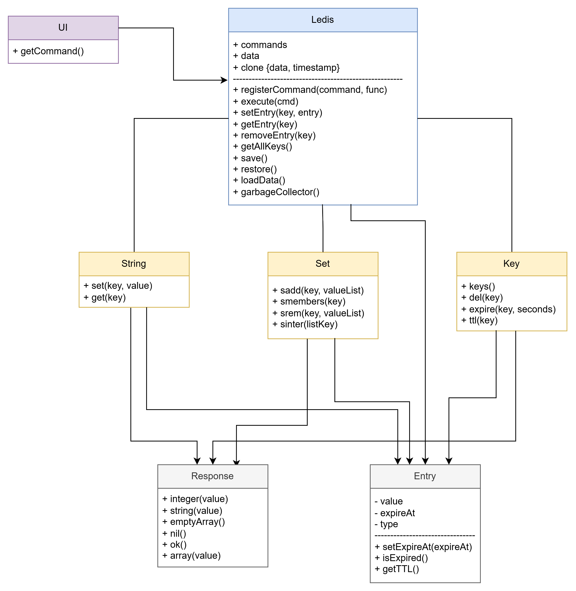
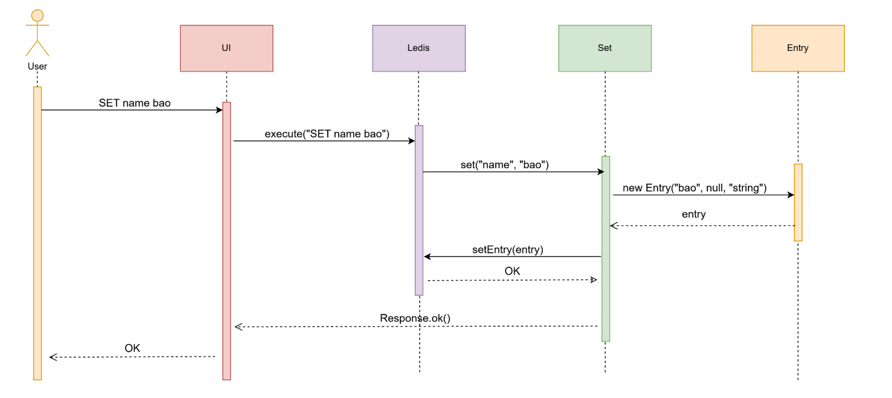
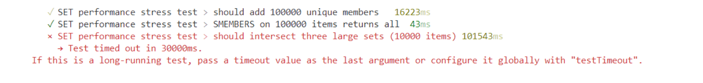

# Building Ledis: A browser-based lightweight Redis clone

For my final-round technical challenge at an innovative tech startup in Vietnam, I built Ledis—a lightweight, browser-based Redis clone designed to deliver Redis-like functionalities directly within your browser. In this post, I'll share the approach I took, discuss the core challenges encountered, and outline the solutions that made Ledis efficient and intuitive.

Ledis leverages vanilla JavaScript and HTML, requiring no external server or build processes. It supports essential Redis commands (`SET`, `GET`, `SADD`, `SINTER`, `EXPIRE`, and more), implements lazy key expiration paired with efficient garbage collection, and achieves O(1) complexity for set operations using JavaScript's native `Set`. To keep the architecture maintainable, I utilized a central `Response` class and a reusable `asyncHandler` for clean formatting and consistent error handling. Persistent storage via `localStorage` ensures data durability across page reloads. Fully tested end-to-end using `Vitest`, Ledis provides an accessible, hands-on environment for developers to explore and understand Redis's internal mechanics interactively.

**Explore the demo:** [Ledis](https://ledis-five.vercel.app)

<!-- more -->

## I. Research phase
 
### 1. Research about Redis

When I first received the assignment, I was anxious because I’d never used Redis before. Since it’s such a widely adopted technology, I watched a “Redis Crash Course” on YouTube and then read the official Redis documentation to understand the commands I needed to implement, studying each command’s input and output in various scenarios.

### 2. Exploring web-based CLI libraries

Next, I investigated existing libraries that provide a command-line interface for the web. Although I found options like xterm.js, none offered the flexibility I needed. As the functionality was relatively straightforward, I decided to build my own web CLI from scratch to ensure it met my precise requirements.

## II. Design phase

### 1. Class diagram



**Description for class diagram:**

- **UI Layer**

    - `getCommand()` reads user input and forwards parsed commands to Ledis.

- **Ledis Core**

    - **Attributes:**

        - `commands`: map of command names to handlers
        - `data`: key→Entry store
        - `clone{data,timestamp}`: snapshot for persistence

    - **Methods:**

        - `registerCommand()`
        - `execute(cmd)`
        - `set/get/removeEntry()`
        - `getAllKeys()`
        - `save()/loadData()/restore()`
        - `garbageCollector()` for expired-key cleanup

- **Data-Type Modules**

    - **String:** `set(key,value)`, `get(key)`
    - **Set:** `sadd(key,valueList)`, `smembers(key)`, `srem(key,valueList)`, `sinter(listKey)`
    - **Key:** `keys()`, `del(key)`, `expire(key,seconds)`, `ttl(key)`

- **Entry**
    - Wraps a value with type, `expireAt` timestamp

    - Methods: `isExpired()`, `getTTL()`, `setExpireAt()`

- **Response**
    - Encodes command results as `ok()`, `integer()`, `string()`, `array()`, `emptyArray()`, or `nil()`

### 2. Sequence diagram

A sequence diagram showing the valid case when the user types the command `SET name bao`.



### 3. Data structure

At first, I planned for each class (e.g. String, Set) to manage its own data independently, which would make their get methods faster. However, that approach complicates checking whether a key’s type is correct or whether a key already exists. Therefore, I decided that the Ledis class will hold all data centrally, and the String, Set, and Key classes will access, add, or update their data exclusively through Ledis’s methods.

```typescript
type Entry = {
  value: string | Set<string>;
  expireAt: number | null;
  type: string;
};

type Data = {
  [key: string]: Entry;
};
```

## III. Implementation phase

### 1. Technology choices

#### a) Framework

Using React for the front end and Express for the back end brings some pros like:

- Clear division between client-side and server-side logic improves maintainability.
- Easier to scale as the website grows.

But because of the simplicity of this project, it would be over-engineering.

Instead, I opted for a single `index.html` file for the UI and wrote all the application logic in plain JavaScript.

Pros:

- No need for builds, compilers, or complex tooling.
- Fewer files and dependencies, faster loading.

Cons:

- Becomes difficult to manage as UI or logic grows.
- Lack of structure makes features harder to isolate or reuse.

#### b) Language

When deciding on a language for the application logic, I initially prioritized static type checking for its ability to catch errors early and improve code clarity.

- **Python** was appealing due to its clean syntax and readability. However, exposing a Python-based API introduces unnecessary complexity for a lightweight project.
- **TypeScript** seemed like a solid middle ground, offering strong typing on top of JavaScript. But the need to recompile on every change—especially during frequent logic tweaking—felt cumbersome and slowed down the development feedback loop.

In the end, I chose vanilla JavaScript for its direct execution in the browser and ease of iteration. While this meant giving up static type safety, it kept the workflow lean and fast.

Pros of JavaScript:

- No compile step—just refresh and run.
- Runs natively in all browsers with no extra tooling.

Cons:

- More prone to runtime errors without static checks.
- Less maintainable at scale.

### 2. Implementation

That evening, I translated the class diagram into code. I started by building the UI in `index.html`, then implemented the core modules—starting with Ledis, String, Set, and so on. Overall, the coding phase was straightforward; I expected to struggle with lexing and parsing, but Redis’s commands are so simple that it turned out to be a non-issue.

The real challenge came from JavaScript’s lack of static typing. I ran into a few bugs when I mistyped property names or attempted to access fields that were undefined. Aside from those hiccups, the implementation went surprisingly smoothly.

## IV. Optimization phase

### 1. Response

#### a) Native inline approach

Initially, response formatting was handled directly within each command handler using inline string concatenation. For example:

```javascript
let response = "";
value.forEach((item, index) => {
  response += index + ") " + '"' + item + '"' + "\n";
});
return response;
```

Pros:

- Quick and simple to implement for small-scale or one-off cases.
- No dependencies or extra abstraction layers.

Cons:

- Leads to code duplication across command handlers.
- Inconsistent formatting is likely as logic is repeated manually.

#### b) Centralized response class

To improve maintainability, I introduced a `Response` class encapsulating all response formatting logic. Each method handles a specific type of output:

```javascript
class Response {
  static integer(value) {
    return "(integer) " + value;
  }
  static string(value) {
    return '"' + value + '"';
  }
  static emptyArray() {
    return "(empty array)";
  }
  static nil() {
    return "(nil)";
  }
  static ok() {
    return "OK";
  }
  static array(value) {
    if (!Array.isArray(value) || value.length === 0) {
      return Response.emptyArray();
    }
    let response = "";
    value.forEach((item, index) => {
      response += index + 1 + ") " + '"' + item + '"' + "\n";
    });
    return response;
  }
  static error(message) {
    return "ERROR: " + message;
  }
}

export default Response;
```

Pros:

- Centralizes all response logic, reducing repetition and potential inconsistencies.
- Improves readability and developer experience by making responses self-documenting.
- Easier to extend or modify formatting across the application.

Cons:

- Minor overhead from abstraction, especially if used in extremely performance-critical paths.

### 2. Argument validation & error handling

#### a) Manual checks and try–catch in handlers

Previously, each command handler contained its own logic for argument validation and error handling. This meant manually verifying argument counts and wrapping risky operations in try–catch blocks.

Pros:

- Offers full control over the logic within each command.
- Easy to reason about in isolation for very simple commands.

Cons:

- Leads to repetitive, boilerplate code across handlers.
- Harder to maintain and scale as the number of commands grows.

#### b) Reusable asyncHandler wrapper

To address the redundancy, I introduced a reusable higher-order function, `asyncHandler`, that wraps each command function with standardized argument validation and error handling:

```javascript
const asyncHandler =
  (fn, exact = true, minArgs = 1) =>
  (...args) => {
    if (exact && args.length !== fn.length) {
      return Response.error("Invalid number of arguments");
    }
    if (!exact && args.length < minArgs) {
      return Response.error("Invalid number of arguments");
    }
    try {
      const result = fn(...args);
      return result;
    } catch (error) {
      console.error("Error in async handler:", error);
      return Response.error(error.message);
    }
  };

ledis.registerCommand("sinter", asyncHandler(LSet.sinter, false, 1));
```

Pros:

- Centralizes validation and error handling logic, reducing duplication.
- Enforces consistency across all command handlers.

Cons:

- Slightly abstracts away control from individual command handlers.
- Error handling is generalized—less flexibility for custom per-command responses unless extended.

### 3. Lazy Expiration

Instead of using `setTimeout` per key, I record the expiration timestamp on each key. On every GET, SET, or TTL call, I compare the current time against that timestamp. If a key has expired, I delete it immediately. This “lazy” approach avoids proliferating timers.

```javascript
getEntry(key, type = undefined) {
  const entry = this.data.get(key);
  if (entry === undefined) {
    return undefined;
  }
  if (entry.isExpired()) {
    this.removeEntry(key);
    return undefined;
  }
  if (type !== undefined && entry.type !== type) {
    throw new Error(`Type mismatch for key '${key}'`);
  }
  return entry;
}
```

Pros:

- Avoids creating and managing a large number of `setTimeout` timers, which can become performance-intensive at scale.

Cons:

- Expired keys remain in memory until accessed again, which can lead to unnecessary memory usage if keys are never touched after expiring.
- Background processes relying on key expiration won't trigger automatically unless an access operation occurs.

### 4. Periodic Garbage Collection

To clean up any expired entries that were never touched after expiring, I run a background sweep every 5 seconds:

```javascript
garbageCollector() {
  setInterval(() => {
    console.log("Garbage collector running...");
    for (const [key, entry] of this.data.entries()) {
      if (entry.isExpired()) {
        console.log("Removing expired entry:", key, entry);
        this.removeEntry(key);
      }
    }
  }, 5000);
}
```

This ensures stale data doesn’t linger indefinitely and waste memory.

### 5. Choosing the right data structure for Set

#### a) Initial Approach: Using Arrays

At first, each Redis-style “set” was implemented using a JavaScript Array. This meant common operations like membership checks and deletions relied on linear scans. As a result, time complexity in the worst case was:

- SADD: O(n × k)
- SMEMBERS: O(n)
- SREM: O(n × k)
- SINTER: O((n₁ + … + nₖ) × min(nᵢ))



Pros:

- Simple and intuitive to implement.

Cons:

- Performance degrades rapidly with set size due to linear searches.
- Frequent duplicate checks and deletions are inefficient.

#### b) Optimized Approach: Using JavaScript Set

To improve performance, I switched to JavaScript’s built-in `Set`, whose core operations—`add`, `has`, `delete`, and `size`—run in O(1) on average. After the change, the worst-case complexities became:

- SADD: O(k)
- SMEMBERS: O(n)
- SREM: O(k)
- SINTER: O(k × min(nᵢ))


Pros:

- Drastically better runtime for operations on large sets.
- Eliminates the need for manual existence checks.

Cons:

- May be less familiar to some developers compared to arrays.

### 6. Persistence storage

To ensure data persistence even after a website reload, each time a user types `save`, the data is stored in both `localStorage` and `this.clone.data`. When the user reloads the page, Ledis retrieves the data from `localStorage`, if available, and updates `this.clone.data` accordingly.

## V. Testing phase

I chose Vitest for its native ESM support and familiar Jest-style API. My test suites cover:

- String commands (`SET`, `GET`)
- Set commands (`SADD`, `SREM`, `SMEMBERS`, `SINTER`)
- Key and expiration commands (`KEYS`, `DEL`, `EXPIRE`, `TTL`)
- Snapshot commands (`SAVE`, `RESTORE`)
- Type-mismatch errors for incorrect command-type usage

Each suite includes both typical and edge-case scenarios to ensure robustness. (see more in [https://github.com/ThaiNguyenGiaBao/Ledis/tree/main/test](https://github.com/ThaiNguyenGiaBao/Ledis/tree/main/test))

## VI. Conclusion

### 1. Challenges

- Gaining familiarity with Redis's command behavior and internal mechanisms required careful study and hands-on experimentation.
- JavaScript’s lack of static types led to occasional bugs when accessing missing object fields.
- Making sure expired keys are removed or ignored without degrading performance.
- I don’t expect that Ledis has a lot of cases to handle, so I need to refactor my code to ensure that I can handle all exceptions and avoid code duplication.

### 2. Interesting points

- I focused on creating a class structure and data model that would allow Ledis to be easily extended with new commands in the future, while maintaining good performance.
- I implemented both lazy expiration (checking on key access) and active expiration (background cleanup using a `garbageCollector()` function), which provided valuable insight into memory management techniques.
- The most valuable takeaway is gaining a deeper understanding of how Redis works under the hood, including command routing, data expiration, and persistence. What seemed like "simple commands" at first turned out to involve careful state tracking, memory management, and user interaction design.

### 3. Results

- Live demo: [https://ledis-five.vercel.app](https://ledis-five.vercel.app)
- Github: [https://github.com/ThaiNguyenGiaBao/Ledis](https://github.com/ThaiNguyenGiaBao/Ledis)
- The code follows SOLID principles, making it easy to extend and maintain.
- Fully implements all required lightweight Redis features.
- Various performance improvements were applied (see the "Optimization Phase" section).
- Comprehensive test coverage—including many edge cases—yielded a smooth, reliable implementation.
