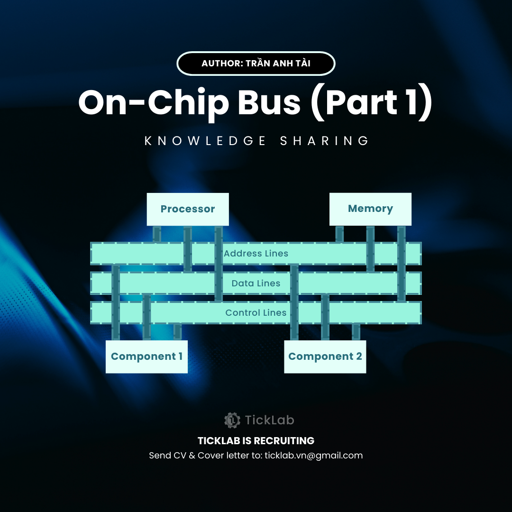

# On-chip BUS [Part 1]
<figure markdown>
{ width="300" }
</figure>

Khi thiết kế một hệ thống SoC (System-on-Chip), việc kết nối giữa các thành phần như Processor, bộ nhớ và các ngoại vi (UART, I2C, SPI,...) là một vấn đề quan trọng. Trong bài viết này, mình sẽ giới thiệu cách các thành phần này giao tiếp với nhau thông qua **On-chip BUS**, cũng như lý do tại sao kiến trúc BUS lại quan trọng và được thiết kế như vậy. Bắt đầu từ những khái niệm cơ bản đến cách tổ chức bộ nhớ và cách Processor giao tiếp với nhiều ngoại vi khác nhau thông qua cơ chế Memory-Mapped I/O.

<!-- more -->

## Tổng quan

### 1. Cấu trúc tổng quát của SoC

Một System-on-Chip thường bao gồm ba thành phần chính:

- **Processor**: Thành phần trung tâm của hệ thống, chịu trách nhiệm điều khiển và xử lý dữ liệu. Processor có thể giao tiếp với cả **Input components** và **Output components**.
- **Memory**: Dùng để lưu trữ chương trình và dữ liệu tạm thời. Bộ nhớ có thể là RAM, ROM, hoặc bộ nhớ cache tích hợp trong Processor.
- **I/O Component (Ngoại vi)**: Gồm các thành phần giao tiếp với bên ngoài như UART, I2C, SPI, GPIO,... giúp SoC trao đổi dữ liệu với các thiết bị bên ngoài.

Hình 1 dưới đây minh họa kiến trúc Von Neumann, trong đó ba thành phần này được kết nối với nhau qua một **BUS giao tiếp**.
<figure markdown>
{ width="400" }
<figcaption>Von Neumann Architecture</figcaption>
</figure>

### 2. Vai trò của BUS trong hệ thống

BUS là thành phần giúp kết nối tất cả các component với Processor và đóng vai trò vận chuyển các gói dữ liệu giữa chúng. Hiện nay, BUS có thể tuân theo các chuẩn giao thức như AXI, AHB, APB (thuộc chuẩn AMBA), hoặc Whisbone, Avalon, ….

Trong chủ đề On-chip BUS này, mình sẽ nói đến các ý tưởng chính của hầu hết các on-chip bus tiêu chuẩn hiện này và lý do tại sao nó lại được thiết kế như vậy. 

## Cơ sở hình thành

### 1. Interface

Nếu như bạn từng học môn Kiến trúc máy tính hoặc từng xem qua các kiến trúc của một general-purpose Processor thì bạn sẽ không thấy interface của nó được  kết nối với các Input component hay Output Component  (như hình bên dưới) 

<figure markdown>
{ width="400" }
<figcaption>Hình minh họa đơn giản của 1 kiến trúc MIPS Processor</figcaption>
</figure>

Vậy theo bạn khi 1 SoC được tích hợp với các Input và Output component thì Processor có nhất thiết phải thêm nhiều loại interface khác nhau để có thể kết nối đến thành phần Input và Output đó không? 

*(Bạn thử dành vài phút ra để nghĩ câu trả lời tốt nhất, rồi hẳn xem tiếp phần sau nhé)*

#### a. Cách tiếp cận 1:

Ở câu hỏi này, nếu bạn nghĩ câu trả là “Có”, thì bạn sẽ tiếp tục đối mặt với 2 bài toàn là:

- *Bài toán thứ 1:* Bạn nên nhớ rằng mỗi Input hoặc Output component có **đặc trưng khác nhau,** dẫn tới khi thiết kế các ngoại vi đó để tích hợp vào hệ thống, thì các **interface khi kết nối vào Processor có thể khác nhau**
    
    Mình lấy ví dụ với 2 ngoại vi protocol là UART (TX) peripheral và I2C (Master) peripheral 
    
    - Đặc trưng UART frame chỉ cần có 1 trường dữ liệu duy nhất,
        <figure markdown>
        { width="280" }
        </figure>

        Nên khi thiết kế UART (TX) peripheral, thì interface của nó chỉ cần có **1 trường để Processor đẩy dữ liệu của TX Data vào** ngoại vi.
        <figure markdown>
        { width="250" }
        </figure>
        
    - Tuy nhiên, Đặt trung của I2C frame cần có 2 - 3 trường dữ liệu, đó là Slave Address frame và Data Frame 1/2 (như hình minh họa bên dưới)
        <figure markdown>
        { width="400" }
        </figure>
        
        Nên khi thiết kế ngoại vi để kết nối đến Processor thì interface của nó khi kết nối đến Processor lại phải cần tới **3 trường dữ liệu để Processor đẩy dữ liệu** Address frame và Data frame vào ngoại vi.
        <figure markdown>
        { width="250" }
        </figure>
        
    
    → Điều này làm interface của Processor trở nên phức tạp hơn do mỗi IO component có đặc trưng tiêng, chưa kể bạn sẽ phải đối mặt với bài toán thứ 2 bên dưới
    
- *Bài toán thứ 2:* Nếu như 1 SoC có 10 - 15 Input và Output component thì chúng ta phải thêm 10 - 15 interface tương ứng vào interface Processor?
    
    

⇒ Với câu trả lời là 'Có', thì mỗi khi tích hợp thêm một ngoại vi mới, chúng ta sẽ cần thiết kế lại toàn bộ Processor, làm tăng đáng kể độ phức tạp. 

Vì thế, cách tiếp cận này không khả thi khi SoC có nhiều ngoại vi. Do đó, chúng ta sẽ đến cách tiếp cận thứ 2 bên dưới.

#### b. Cách tiếp cận 2:

Nếu câu trả lời của bạn là “Không”, vậy interface để Processor kết nối với các Input component và Output component đó nằm ở đâu?

*Đây là câu trả lời:*

<figure markdown>
{ width="400" }
</figure>

Processor xem các Input và Output component như là các vùng nhớ (Memory), nơi nó có thể trao đổi dữ liệu (data) thông qua việc đọc ghi. Và hiển nhiên, mỗi vùng nhớ sẽ có địa chỉ (address) cụ thể, điều nay tương ứng với mỗi Input và Output component sẽ có các vùng địa chỉ riêng biệt.

Cơ chế này gọi là **Memory-Mapped I/O**.

Do đó, interface giữa Processor và các component bên trong hệ thống sẽ sử dụng chung loại với interface với Data Memory, gồm các tín hiệu sau:

- `Address`
- `WriteData`
- `ReadData`
- `MemRead` enable
- `MemWrite` enable

Có thể chia 5 tín hiệu này thành 3 trường chính:

- Trường địa chỉ (Address Lines) - bao gồm `Address` bus → Dùng để ánh xạ đến vùng địa chỉ muốn thực thi
- Trường dữ liệu (Data Lines) - bao gồm `WriteData` bus và `ReadData` bus → Dùng truyền dữ liệu
- Trường điều kiển (Control Lines) - bao gồm `MemRead` và `MemWrite` → Dùng để phân loại các thực thi

<figure markdown>
{ width="400" }
</figure>

→ Khi đó chỉ cần chân **address được ánh xạ đến component nào** thì component đó có nghĩa vụ:

- Nhận data từ `WriteData` nếu có tín hiệu `MemWrite`
- Gửi trở lại `ReadData` cho Processor nếu có tín hiệu `MemRead`

Như vậy bạn có thể thấy chỉ với 3 trường thông tin đã đề cập, thì Processor có thể quản lý được rất nhiều component khác nhau như hình bên dưới:

<figure markdown>
{ width="400" }
</figure>

Mỗi component có một vùng địa chỉ (**address region**) riêng biệt, và địa chỉ bắt đâu của 1 vùng địa chỉ được gọi là địa chỉ cơ sở (**base address**) của component đó. 

- Một vài ví dụ về việc dùng Memory-Mapped để quản lý các ngoại vi (IO component) trong các dòng vi điều khiển:
    1. Bảng ánh xạ địa chỉ các ngoại vi của một dòng STM32
        <figure markdown>
        { width="400" }
        <figcaption>Memory Map table of an ARM STM32’s family</figcaption>
        </figure>
        
    2. Bảng ánh xạ địa chỉ các ngoại vi của một dòng ESP32
        <figure markdown>
        { width="400" }
        <figcaption>Memory Map table of a ESP32’s family</figcaption>
        </figure>

Tuy nhiên, chúng ta chỉ mới giải quyết được 1 bài toán là “Làm sao để Processor quản lý 10 - 15 Input và Output component chỉ với 1 interface duy nhất?” (bài toán thứ 2 ở trên).

Vậy còn bài toán thứ 1: “Mỗi component có các **đặc trưng khác nhau** dẫn tới **số lượng trường dữ liệu trao đổi cũng sẽ khác nhau** (Xem lại [*Bài toán thứ 1*](#a-cach-tiep-can-1) ), thì Processor sẽ quản lý như thế nào, để vẫn giữ nguyên tính thống nhất với interface trên?” 

*Câu trả lời:* **Tiếp tục phân mảnh nhỏ địa chỉ** ra thành các vùng địa chỉ con, đại diện cho chức năng riêng của mỗi component. 

Ví dụ: Processor sẽ quản lý 2 ngoại vi là UART và I2C (ở ví dụ này mình **tạm thời sẽ fix cứng** các thông số cấu hình cho UART hay I2C mà chỉ quan tâm các dữ liệu truyền và nhận thôi)

- Đối với UART sẽ cần có 2 dữ liệu chính là: `TX Data` + `RX Data`
- Đối với I2C sẽ có 3 loại dữ liệu chính là: `Slave Address` + `Write Data` + `Read Data`

Với mỗi loại trường dữ liệu của 1 component, mình sẽ phân nhỏ ra vào các vùng địa chỉ con, nhưng vẫn phải nằm trong vùng địa chỉ cơ sở (base address) của component tương ứng. 

Đây là hình minh họa cho việc **phân nhỏ các vùng địa chỉ con**

<figure markdown>
{ width="400" }
</figure>

<figure markdown>
{ width="400" }
</figure>

Theo như các vùng địa chỉ đã phân trong hình minh họa, khi bạn muốn UART gửi data qua TX Data ra ngoài, bạn chỉ cần đưa dữ liệu vào vùng nhớ có địa chỉ 0x2000_0000 (`TX Data`). Hoặc, bạn muốn I2C ghi data ra 1 slave nào đó bên ngoài thông qua I2C protocol, bạn chỉ cần đưa dữ liệu vào 2 vùng nhớ có địa chỉ 0x3000_0000 (`Slave Address`) và 0x3000_0001 (`Write Data`) 

Mỗi trường địa chỉ `TX Data` , `RX Data` , `Slave Address` , `Write Data` , `Read Data` này được gọi là các thanh ghi dữ liệu (**data register**), mỗi component sẽ có các thanh ghi dữ liệu riêng biêt tương ứng với component đó.

Mỗi thanh ghi dữ liệu sẽ cách địa chỉ cơ sở (base address) của component tương ứng 1 khoảng gọi là **offset.** 

1. **Data Registers**
    
    Như đã đề cập ở trên, các thanh ghi này dùng cho các trường dữ liệu chính của component đó. 
    
    Ví dụ: UART sẽ các các thanh ghi chức năng
    
    - `UART_TX_DATA` register: chứa dữ liệu gửi của UART mà người dùng muốn gửi qua TX port
    - `UART_RX_DATA` register: chứa dữ liệu nhận của UART thông qua chân RX port
    - v.v

1. **Configuration Registers**
    
    Ngoài các thanh ghi cho chức năng ra, thì sẽ còn các thanh ghi cấu hình (**configuration registers**) cho component đó, các thanh ghi cấu hình có chức năng thiết lập các tham số (parameter) cho các component, cũng như chế độ hoạt động của nó.
    
    Ví dụ: UART sẽ có các thanh ghi cấu hình
    
    - `UART_EN` register: dùng để bật/tắt
    - `UART_IRQ_MASK` register: dùng để bật/tắt interrupt của ngoại vi
    - `UART_BAUDRATE` register: dùng để chọn mức baudrate cho UART protocol
    - `UART_LEN` register: dùng để kích thước của 1 data frame của UART
    - `UART_PARITY` register: dùng để chọn Odd/Even/None parity bit
    - v.v

1. **Status Registers**
    
    Status registers là các thanh ghi giúp người dùng có thể theo dõi trạng thái hoạt động của component đó. Thường các thanh ghi này sẽ chỉ cho phép người dùng đọc ra trạng thái (read-only registers)
    
    Ví dụ: UART có thể có vài thanh ghi trạng thái sau
    
    - `UART_TX_STATE` registers: trả về trạng thái của bộ điều khiển TX của UART (IDLE hoặc BUSY)
    - `UART_RX_STATE` registers: trả về trạng thái của bộ điều khiển TX của UART (IDLE hoặc BUSY)
    - `UART_IRQ_SOURCE` registers: trả về nguyên nhân của tín hiệu interrupt (thanh ghi này được dùng trong trường hợp có **nhiều sự kiện ngắt nhưng chỉ dùng chung 1 chân interrupt** cho ngoại vi đó)
    - v.v`

> **Đối với lớp software**: thì người dùng sẽ chia các thanh ghi này thành **3 loại**
> 
> - Data reigsters
> - Configuration registers
> - Status reigster
> 
> **Đối với lớp hardware (thiết kế RTL):** thì người thiết kế sẽ chia thanh ghi thành **4 loại**
> 
> - Read-write (RW) registers
> - Read-only (RO) registers
> - Write-1-to-set (RW1S) registers
> - Write-1-to-clear (RW1C) registers
> 
> Tương ứng mỗi loại sẽ có 1 đặt trưng riêng, mình sẽ nói rõ hơn ở bài viết chia sẻ sau.
> 

Do đó, với phương pháp sử dụng Memory-Mapped mang lại khá nhiều lợi ích:

- **Giảm độ phức tạp cho Processor**: do interface đã được thống nhất với Data Memory từ trước, nên khi ta tích hợp thêm nhiều component thì cũng không ảnh hướng đến interface ban đầu
- **Tăng khả năng mở rộng 1 SoC**: khi muốn mở rộng số lượng ngoại vi, bên thiết kế chỉ cần quy định thêm vùng địa chỉ cho ngoại vi tương ứng mà không làm ảnh hưởng quá nhiều hệ thống trước.
- **Dễ dàng phát triền và mở rộng firmware/software**: khi sử dụng SoC, thì người phát triển firmware/software chỉ cần quan tâm đến vùng địa chỉ tương ứng của component đó.

### 2. Behavior

Như đã đề cập ở trên, Processor sẽ giao tiếp với các component thông qua interface của Data Memory gồm các tín hiệu

- Address lines:
    - `Address`
- Data lines:
    - `WriteData`
    - `ReadData`
- Control lines:
    - `MemWrite`
    - `MemRead`

Tuy nhiên, đây là interface 1 chiều (chỉ có hướng từ Processor → Components), nghĩa là trong trường hợp **component không sẵn sàng** nhận `WriteData` hay trả về `ReadData`, thì có thể dẫn tới việc `WriteData` bị rớt, hoặc `ReadData` sẽ là 1 data không xác định.

Và việc component không sẵn sàng rất **thường xuyên xảy ra,** với các trường hợp cụ thể như sau:

- *Đối với `WriteData` (write operation)*: đa số thiết kê bên trong các component đó đều đặt các buffer (hay còn gọi là FIFO) ở interface để component có thể đệm lại các data vào trong hàng chờ xử lý, tuy nhiên buffer này luôn có giới hạn và việc **xử lý 1 data có thể lâu hơn việc gửi vào 1 data** rất nhiều. Dẫn tới việc bị rớt `WriteData` sẽ xảy ra thường xuyên hơn nếu không có cơ chế kiểm soát.
- Đối với `ReadData` (read operation): thường thì `ReadData` sẽ được đi kèm với 1 cơ chế ngắt (interrupt), trong trường hợp `ReadData` đã sẵn sàng thì component sẽ gửi 1 tín hiệu ngắt đến processor. Tuy nhiên, **không phải component nào cũng sẽ bật chế độ sử dụng tín hiệu ngắt,** một vài component mà người dùng chỉ muốn quản lý bằng cơ chế chờ đọc (pooling), vậy bài toán lúc này là: “Lúc nào `ReadData` đã sẵn sàng bên trong component?”

Từ vấn đề trên, các on-chip protocol sẽ phải **thêm một vài tín hiệu từ Component đến Processor** (như component_ready hoặc component_busy), để Processor biết khi nào `WriteData` đã sẵn sàng được nhận, và `ReadData` đã sẵn sàng được component gửi đi.

→ Cơ chế này được gọi chung là **Hanshaking protocol**

**Handshaking protocol**

Trong handshaking protocol sẽ chia thành các thành phần thành 2 loại:

1. **Master**: bên chủ động tạo ra các giao dịch (transfer)
2. **Slave**: bên nhận các giao dịch và phản hồi về master (nếu có)

Mỗi transfer sẽ được chia làm 2 loại chính:

1. **Write transfer**: Master yêu cầu ghi dữ liệu vào 1 Slave
    <figure markdown>
    { width="300" }
    <figcaption>Direction of all ports in Write channel</figcaption>
    </figure>
    
    
    _Bước 1_: Master sẽ đưa địa chỉ và dữ liệu tương ứng vào `WR_ADDR` port và `WR_DATA` port và kéo chân yêu cầu ghi (`WR_REQ` port) lên mức 1.
    
    _Bước 2_: Khi Slave sẵn sàng nhận dữ liệu thì sẽ kéo chân `WR_ACK` port lên mức 1 để báo hiệu đã nhận data
    
    _Bước 3_: Sau khi xác nhận giao dịch hoàn tất (đồng thời cả `WR_REQ` và `WR_ACK` ở mức cao cùng) thì xem như giao dịch hoàn tất và Master có thể tiếp tục tạo giao dịch mới hoặc không. 
    <figure markdown>
    { width="650" }
    </figure>
    
2. **Read transfer**: Master yêu cầu đọc dữ liệu từ 1 Slave
    <figure markdown>
    { width="300" }
    </figure>
    
    Direction of all ports in Read channel
    
    _Bước 1_: Master sẽ đưa địa chỉ tương ứng vào `RD_ADDR` port và kéo chân yêu cầu ghi (`RD_REQ` port) lên mức 1.
    
    _Bước 2_: Slave sau khi nhận `RD_ADDR` sẽ tìm đến vùng địa chỉ tưởng ứng và truy xuất dữ liệu của vùng đó. Sau khi dữ liệu đã sẵn sàng thì Slave sẽ đưa dữ liệu vào `RD_DATA` port, đồng thời kéo chân `RD_ACK` port lên mức 1.
    
    _Bước 3_: Sau khi xác nhận giao dịch hoàn tất (đồng thời cả `RD_REQ` và `RD_ACK` ở mức cao cùng) thì xem như giao dịch hoàn tất và Master có thể tiếp tục tạo giao dịch mới hoặc không.
    <figure markdown>
    { width="650" }
    </figure>
    

## Tổng kết
Trong phần đầu tiên của bài viết về On-chip BUS, bạn đã biết cách một SoC có thể kết nối và điều khiển nhiều thành phần khác nhau (như UART, I2C, v.v) chỉ với một interface duy nhất nhờ cơ chế Memory-Mapped I/O. Qua đó, chúng ta thấy được lợi ích của việc chuẩn hóa giao tiếp trong hệ thống, giúp giảm độ phức tạp khi tích hợp nhiều ngoại vi.

Bằng cách ánh xạ mỗi component vào một vùng địa chỉ riêng, và chia nhỏ vùng địa chỉ này thành các thanh ghi con, Processor có thể dễ dàng trao đổi dữ liệu, thiết lập cấu hình, và theo dõi trạng thái hoạt động của từng component.